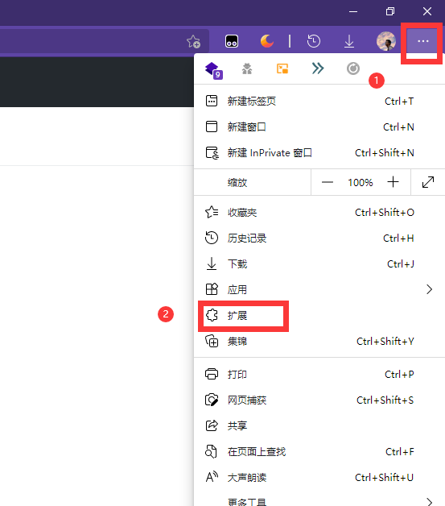
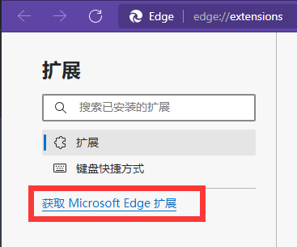
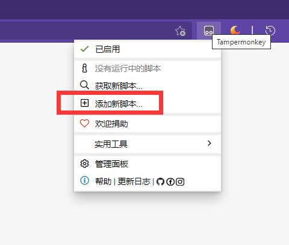

# unipus
## u校园脚本  
### 脚本信息
>@description  显示U校园题目答案；支持单元测试、班级测试；自动答题；刷时长；开放自定义设置  
>@version      1.4.1  
>@author       [SSmJaE](https://github.com/SSmJaE)  
>@license      GPL-3.0  

----------------------
### 脚本配置过程
#### 1. 安装油猴：使用新版edge（推荐）、Firefox或chrome点击浏览器拓展，点击左侧获取脚本搜索`Tampermonkey`  
  
  
#### 2. 添加脚本到油猴：点击添加后复制`main.js`的所有内容粘贴后保存即可  
  
#### 3.打开U校园网站，脚本检测到域名会自动运行  
### 自动答题在脚本界面左上角的设置图标中打开

